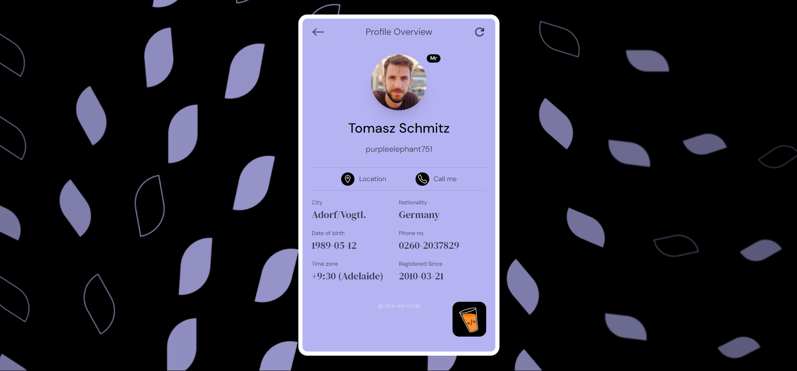

# Project Title
Master-Ji
## Project Overview
This project is a web application that showcases three distinct features:

1. **Random User Profile**: Fetch and display random user profiles with dynamic styling and interactive elements.
2. **Random Jokes Tweet**: Display random jokes as tweet-like cards with static author details and dynamic analytics.
3. **Cats Listing**: Paginate through a list of cats, with horizontally scrolling cards to display cat information.

The application uses various APIs to fetch data and includes creative loading states and interactive features.

## Features

### 1. Random User Profile
- **Component Styling**: Styled to match the provided Figma design.
- **Refresh Button**: Fetches the next random user profile when clicked.
- **Loading State**: Custom loading indicator while data is being fetched.
- **API Mapping**: Maps API response fields to match the Figma design.
- **Hyperlinks**: Location and call buttons open new tabs or initiate actions accordingly.

**API Endpoint**: [Random Users API](https://api.freeapi.app/api/v1/public/randomusers/user/random)

### 2. Random Jokes Tweet
- **Static Author Details**: Example - Elon Musk.
- **Dynamic Analytics**: Randomly generated timestamp, views, date, and other analytics.
- **Loading State**: Custom loading indicator while joke data is being fetched.
- **Content Replacement**: On page reload, the joke data is updated with new content.

**API Endpoint**: [Random Jokes API](https://api.freeapi.app/api/v1/public/randomjokes/joke/random)

### 3. Cats Listing
- **Paginated List**: Displays a horizontal scroll of cat cards with pagination controls.
- **Loading State**: Custom loading indicator while cat data is being fetched.
- **Pagination**: Controls to navigate through cat listings, with the option to adjust limit and page size.

**API Endpoint**: [Cats API](https://api.freeapi.app/api/v1/public/cats?page=1&limit=4)

## Installation

1. **Clone the Repository**:
   ```sh
   git clone https://github.com/aakashzz/Master-ji.git
   cd Master-ji
## Usage Instructions
Instructions on how to use the project.

## Screenshots


## Hosted Website
Check out the live version at [Your Hosted Website](https://master-ji-nu.vercel.app/).
